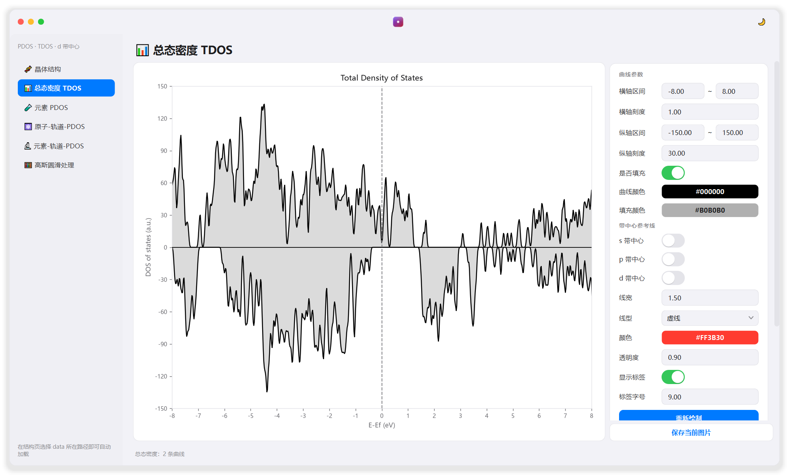
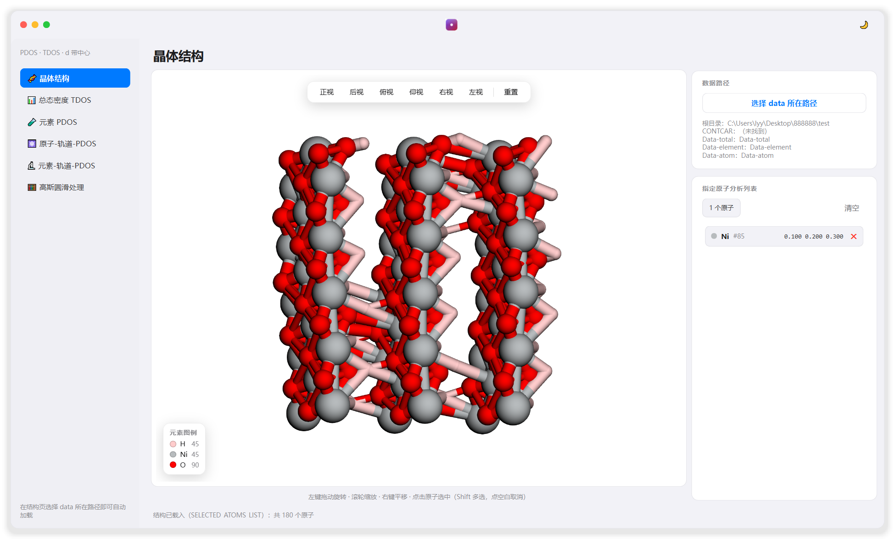
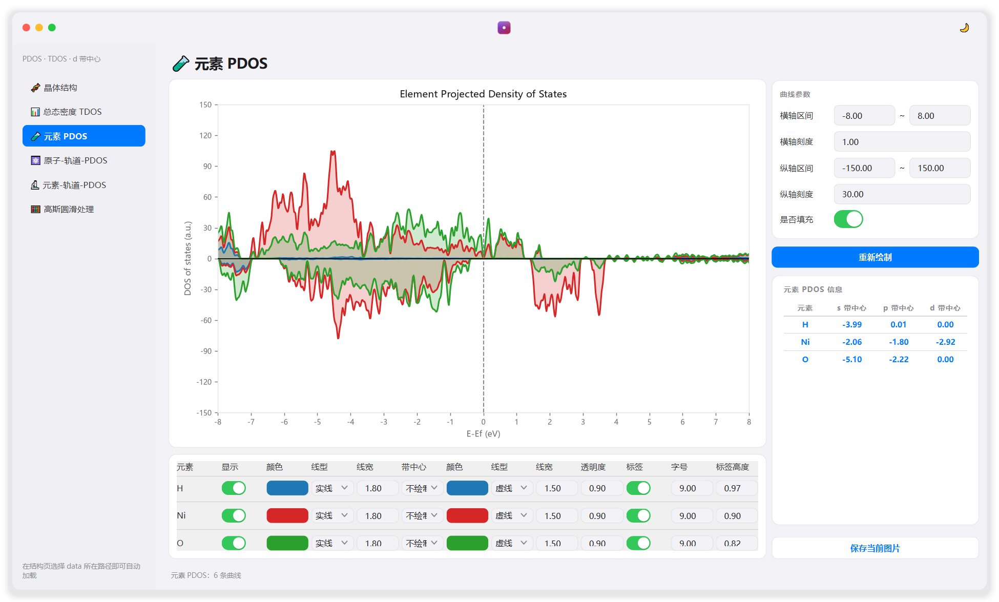
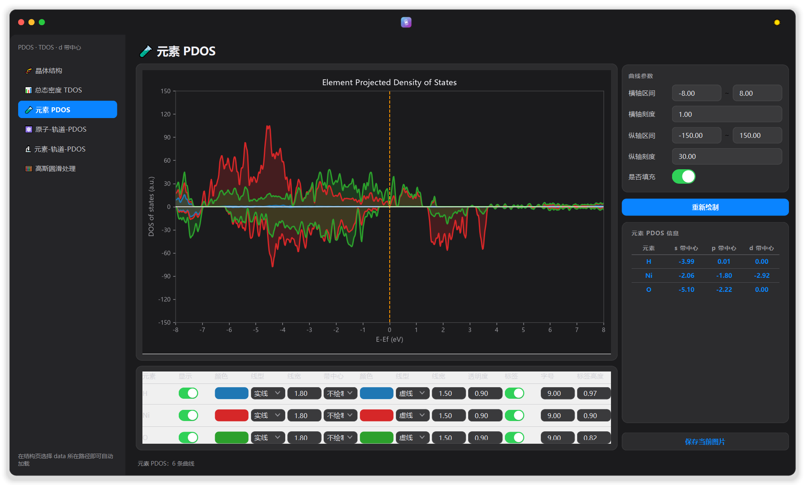
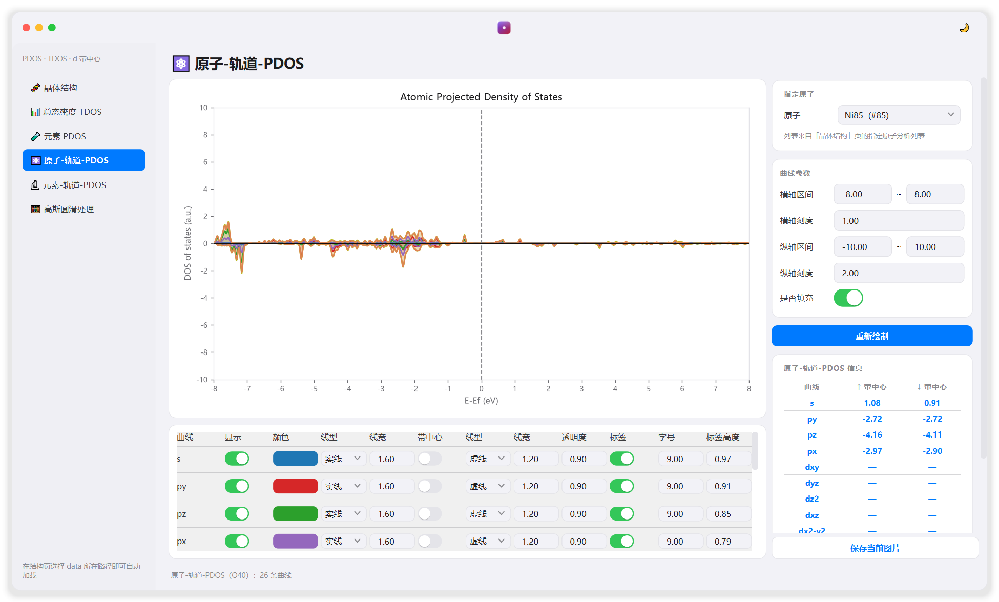
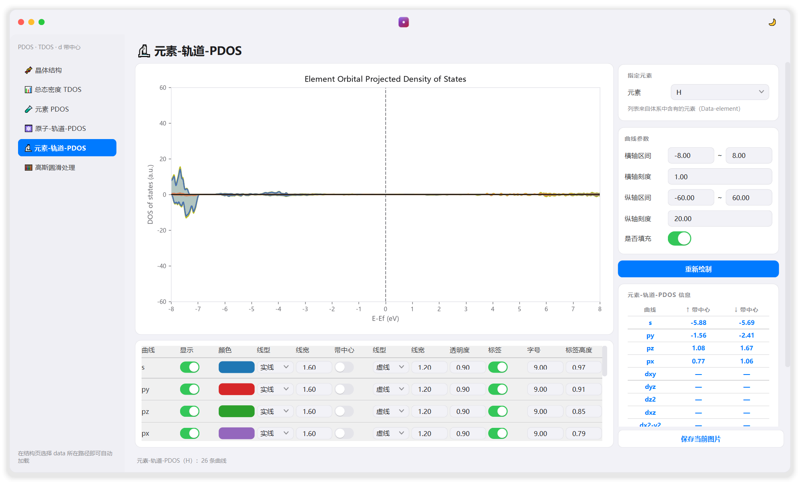
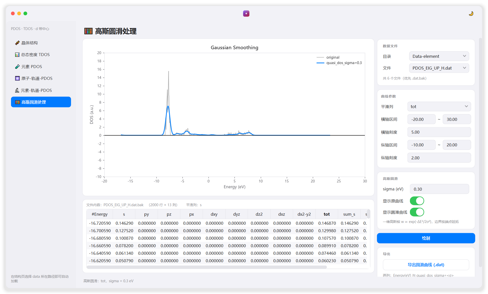

<div align="center">

# PDOS · 结构分析工作台

**VASP 态密度 / 晶体结构可视化桌面工具**

用 3Dmol.js 看结构，用 Matplotlib 画 DOS，右栏调参、左栏切换 —— 一套 iOS / macOS 风格的界面。

[](https://www.python.org/)
[](https://doc.qt.io/qtforpython/)
[](https://matplotlib.org/)
[](https://3dmol.csb.pitt.edu/)
[](#-快速开始)
[](LICENSE)
[](https://github.com/moyulyy/plot_PDOS/releases)
[](https://github.com/moyulyy/plot_PDOS/stargazers)

[功能](#-功能) · [界面预览](#-界面预览) · [**⬇ 便携版下载**](https://github.com/moyulyy/plot_PDOS/releases/latest) · [快速开始](#-快速开始) · [数据目录](#-数据目录) · [算法](#-带中心band-center算法) · [打包](#-打包成便携程序包) · [常见问题](#-常见问题)

</div>

---

## 🖼 界面预览

<div align="center">

**📊 总态密度 TDOS** — 上下自旋、带隙 / 磁性自动识别、s / p / d 带中心参考线



</div>

<details open>
<summary><b>🧬 晶体结构</b> —— 球棍模型 · 正交投影 · 六视角 · 点选原子</summary>



</details>

<details>
<summary><b>🧪 元素 PDOS</b> / <b>⚛️ 原子-轨道-PDOS</b> / <b>🔬 元素-轨道-PDOS</b> —— 逐元素、逐原子、逐轨道曲线 + 带中心</summary>

| 元素 PDOS（明） | 元素 PDOS（暗） |
| :---: | :---: |
|  |  |

| 原子-轨道-PDOS | 元素-轨道-PDOS |
| :---: | :---: |
|  |  |

</details>

<details>
<summary><b>🧮 高斯圆滑处理</b> —— 底栏表格化查看文件内容，指定列做一维高斯圆滑并导出</summary>



</details>

---

## ✨ 功能

### 🧬 晶体结构
- **3Dmol.js** 球棍模型，**正交投影**，元素颜色 / 半径取 VESTA 风格
- 六个标准视角（正视 / 后视 / 俯视 / 仰视 / 右视 / 左视）+ 重置，按钮排在**一行**
- 鼠标拖动旋转、滚轮缩放、右键平移；**点击原子**弹出分数坐标，可加入「指定原子分析列表」（`Shift` 多选，点空白取消）
- 无默认数据路径：点「选择 data 所在路径」后自动发现 `Data-total` / `Data-element` / `Data-atom` 与 `CONTCAR / POSCAR` 并载入
- 针对半透明无边框窗口的 **WebGL 闪烁修复**（不透明画布 + 不透明页面背景）

### 📊 总态密度 TDOS
- 上 / 下自旋总态密度曲线，填充 / 颜色 / 线型 / 线宽可调
- 费米线（`E-Ef = 0` 虚线）与零线始终绘制，**无需开关**
- 自动识别**带隙 / 半导体 / 导体**与**自旋极化（磁性）**
- `s` / `p` / `d` 带中心参考竖线（数据来自 `Data-total/BAND_CENTER` 的 `#Average`），标签字号可调，标签放在竖线右侧，格式 `εs=-3.99`

### 🧪 元素 PDOS
- 读取 `Data-element/PDOS_EIG_UP|DW_<元素>.dat.bak` 的 **`tot` 列**（缺失时回退 `.dat`），每个元素每个自旋一条曲线
- **一行一个元素**、横向铺满，不挤在一起
- 右侧信息表格：`元素 | s 带中心 | p 带中心 | d 带中心`
- 每当元素样式**超过 4 行**时该区域自动竖向滚动，不挤压中间的 DOS 图

### ⚛️ 原子-轨道-PDOS
- 顶部下拉选择原子（列表来自「指定原子分析列表」），逐轨道绘制 `s / py / pz / px / dxy / dyz / dz2 / dxz / dx2-y2 / tot / sum_s / sum_p / sum_d`
- 带中心**没有现成数据**，按通用公式实时计算（见下文），右侧表格给出 `曲线 | ↑ 带中心 | ↓ 带中心`
- 图上每条曲线**只画一条**带中心竖线，取上 / 下自旋中**较高者**，标签 `ε<轨道>=<值>`（不带自旋箭头）
- 每条曲线可单独设置**标签高度**（0–1，轴比例），避免标签互相重叠或压住 `y = 0` 轴

### 🔬 元素-轨道-PDOS
- 与「原子-轨道-PDOS」同款布局与交互，数据源换成 `Data-element/PDOS_EIG_UP|DW_<元素>.dat.bak`，下拉为**指定元素**

### 🧮 高斯圆滑处理
- 任选 `Data-total` / `Data-element` / `Data-atom` 中的一个文件（同名优先 `.dat.bak`）
- 中间**下方**以**表格**展示文件全部内容，当前平滑列的表头高亮
- 指定**平滑列**与高斯 `σ`，一键「绘制」，同图叠加**原曲线**与**圆滑曲线**（带图例）
- 可把圆滑结果导出为两列文本：`Energy(eV)` 与 `quasi_dos_sigma=<σ>`

### 🖼 保存当前图片
四个曲线页面（TDOS / 元素 PDOS / 原子-轨道-PDOS / 元素-轨道-PDOS）的右栏**右下角底部**固定一个「保存当前图片」按钮（不随右栏滚动）：

| 页面 | 默认文件名 |
| ---- | ---- |
| 总态密度 | `TDOS.png` |
| 元素 PDOS | `Element-PDOS.png` |
| 原子-轨道-PDOS | `Atom-Orbital-PDOS_<原子序号>.png` |
| 元素-轨道-PDOS | `Element-Orbital-PDOS_<元素>.png` |

- 保存的就是当前画布上呈现的图像（所见即所得，含主题背景色），`300 dpi`
- 支持 **PNG / PDF / SVG / JPEG**，未写扩展名自动补 `.png`；尚无曲线时会提示

### 🎛 交互细节
- 无边框半透明窗口、红黄绿「交通灯」、圆角 + 手绘柔和阴影
- **明 / 暗主题**一键切换（右上角按钮），曲线图与表格同步换色
- 鼠标**滚轮不会误改**输入框 / 下拉框的值（滚轮会转发给所在面板继续滚动）

---

## 🚀 快速开始

### 方式一：便携版（推荐给不装 Python 的用户）

到 [**Releases**](https://github.com/moyulyy/plot_PDOS/releases) 下载 `PDOS-Viewer-vX.Y.Z-win64.zip`，解压后双击 **`PDOS-Viewer.exe`** 即可，无需安装 Python 或任何依赖。

> 整个文件夹可直接拷到 U 盘 / 其它 x64 Windows 10、11 电脑运行（约 620 MB，绝大部分是 QtWebEngine）。

### 方式二：源码运行

```bash
git clone https://github.com/moyulyy/plot_PDOS.git
cd plot_PDOS
pip install PySide6 matplotlib numpy
python pdos_viewer.py
```

Windows 下也可直接双击 `run_pdos_viewer.bat`（使用 `pythonw.exe`，无控制台窗口）。

首次使用：进入「🧬 晶体结构」页 → 点「选择 data 所在路径」→ 选中含 `Data-*` 与 `CONTCAR` 的文件夹。

---

## 📂 数据目录

选中 data 路径后程序会自动发现：

```
<data>/
├── CONTCAR / POSCAR
├── Data-total/      TDOS.dat、FERMI_ENERGY、BAND_CENTER
├── Data-element/    PDOS_EIG_UP|DW_<元素>.dat(.bak)
│                    BAND_CENTER_p-dbandcenter_<元素>、SELECTED_ATOMS_LIST_*
└── Data-atom/       PDOS_EIG_UP|DW_<编号>.dat(.bak)
```

`Data-element/*.dat(.bak)` 与 `Data-atom/*.dat(.bak)` 表头列一致（`.bak` 为 14 列，优先使用）：

```
#Energy  s  py pz px  dxy dyz dz2 dxz dx2-y2  tot  sum_s sum_p sum_d
```

其中**上自旋为正、下自旋为负**，因此计算带中心时取 `g = |DOS|`。

---

## 📐 带中心（Band center）算法

`Data-element/` 里已有现成的 `BAND_CENTER_p-dbandcenter_*`，但 `Data-atom/` 没有逐原子的带中心数据，因此在「⚛️ 原子-轨道-PDOS」与「🔬 元素-轨道-PDOS」页，对每条曲线的上 / 下自旋**实时计算**：

```
        ∫ E · g(E) dE
ε  =  ─────────────────
          ∫ g(E) dE
```

- `E`：相对费米能级的能量（eV），即文件中的 `#Energy` 列（`E_F = 0`）；
- `g(E)`：该轨道（`s` / `py` / `pz` / `px` / `dxy` / `dyz` / `dz2` / `dxz` / `dx2-y2` / `tot` / `sum_s` / `sum_p` / `sum_d`）的态密度，取 **`g = |DOS|`**；
- 积分区间为该 `.dat(.bak)` 文件给出的**全部能量点**。

数值实现用**梯形法**（`pdos_viewer.band_center`）：

```
          Σᵢ ½(Eᵢ·gᵢ + Eᵢ₊₁·gᵢ₊₁) · ΔEᵢ
ε  ≈  ───────────────────────────────────── ,   ΔEᵢ = Eᵢ₊₁ − Eᵢ
                Σᵢ ½(gᵢ + gᵢ₊₁) · ΔEᵢ
```

分母（积分态密度）趋近 0 时（该轨道没有态密度）结果记为 `—`。图上参考竖线**上 / 下自旋只画一条，取带中心较高者**，颜色默认与曲线颜色一致。

---

## 〰️ 高斯圆滑（一维）

「🧮 高斯圆滑处理」页按

```
g̃(E) = Σᵢ wᵢ · g(Eᵢ),   wᵢ ∝ exp( - (E - Eᵢ)² / (2σ²) )
```

计算（离散网格上等价于与高斯核做卷积，核宽 `±4σ`），边界采用**端点延拓**，避免两端被拉向 0；`σ = 0` 时输出与原始曲线完全一致。

导出格式（两列：`Energy(eV)` 与 `quasi_dos_sigma=<σ>`）：

```
# Gaussian smoothed DOS
# source : PDOS_EIG_UP_H.dat.bak
# column : tot
# sigma  : 0.300000 eV
# Energy(eV)   quasi_dos_sigma=0.300000
   -16.72059000       0.00000000
```

---

## 📦 打包成便携程序包

双击 `build_portable.bat`（或执行 `pyinstaller --noconfirm --clean PDOS-Viewer.spec`）：

```
dist/PDOS-Viewer/
├── PDOS-Viewer.exe      ← 双击即可运行，无需安装 Python
├── _internal/           ← Qt / QtWebEngine / matplotlib 等运行时依赖
├── 3dmol/               ← 3Dmol.js（运行时生成的 _viewer.html 也在此）
├── assets/              ← 程序图标
├── README.md
└── 使用说明-便携版.txt
```

程序对「可写目录」与「只读资源」做了区分（见 `pdos_viewer.py` 顶部）：

| 变量 | 源码运行 | 打包运行 | 用途 |
| ---- | ---- | ---- | ---- |
| `APP_DIR` / `BASE_DIR` | 脚本目录 | exe 所在目录 | 数据文件夹、导出文件、`_viewer.html` |
| `RES_DIR` | 脚本目录 | `_MEIPASS`（即 `_internal/`） | `3dmol/3Dmol-min.js`、`assets/app.ico` |

因此打包后默认的「保存图片 / 导出数据」目录就是 exe 所在目录；若该目录不可写，`_viewer.html` 会自动写到 `%TEMP%/pdos_viewer/`（同时复制一份 `3Dmol-min.js`），3D 页仍可正常工作。

---

## 🗂 项目结构

```
plot_PDOS/
├── pdos_viewer.py          # 主程序（窗口、页面、绘图、算法）
├── ui_kit.py               # iOS / macOS 风格控件与 QSS 主题
├── 3dmol/3Dmol-min.js      # 3D 结构渲染引擎（本地，无需联网）
├── assets/app.ico          # 程序图标
├── docs/                   # README 截图
├── PDOS-Viewer.spec        # PyInstaller 打包配置
├── build_portable.bat      # 一键打包脚本
├── run_pdos_viewer.bat     # 源码运行脚本
└── README.md
```

---

## ❓ 常见问题

<details>
<summary><b>3D 结构区域白屏 / 全黑？</b></summary>

属于显卡 / WebGL 问题，可尝试：

- 更新显卡驱动；
- 右键 `PDOS-Viewer.exe` →「以管理员身份运行」；
- 远程桌面 / 虚拟机中请开启硬件加速。

其余 DOS 绘图页面不受影响。
</details>

<details>
<summary><b>双击 exe 没有反应？</b></summary>

请确认 `_internal` 文件夹与 exe 在同一目录。便携版请**整体解压**后再运行，不要只把 exe 复制出来。
</details>

<details>
<summary><b>杀毒软件报警？</b></summary>

PyInstaller 打包的无签名 exe 常见误报，添加信任即可；也可按上文「方式二」用源码运行。
</details>

<details>
<summary><b>带中心显示 <code>—</code>？</b></summary>

说明该轨道在整段能量区间内的积分态密度趋近 0（例如 H 没有 `d` 轨道），属正常结果。
</details>

<details>
<summary><b>中文 / 负号显示成方块？</b></summary>

程序会按 `Microsoft YaHei UI → Microsoft YaHei → SimHei → PingFang SC → Segoe UI → DejaVu Sans` 的顺序寻找字体，一般无需设置。Linux / macOS 上请确保至少安装其中一种中文字体。
</details>

---

## 🧰 环境要求

| 项目 | 版本 |
| ---- | ---- |
| Python | 3.9+（开发环境 3.14） |
| PySide6 | 6.x（含 QtWebEngine） |
| matplotlib | 3.x |
| numpy | 1.x / 2.x |
| 3Dmol.js | 已随仓库内置 |
| 操作系统 | Windows 10 / 11 x64（源码运行支持 Linux / macOS） |

---

## 📄 License

本项目采用 [MIT License](LICENSE)。

---

<div align="center">

**如果这个工具对你有帮助，欢迎 Star ⭐ 或提 Issue 反馈问题。**

</div>
